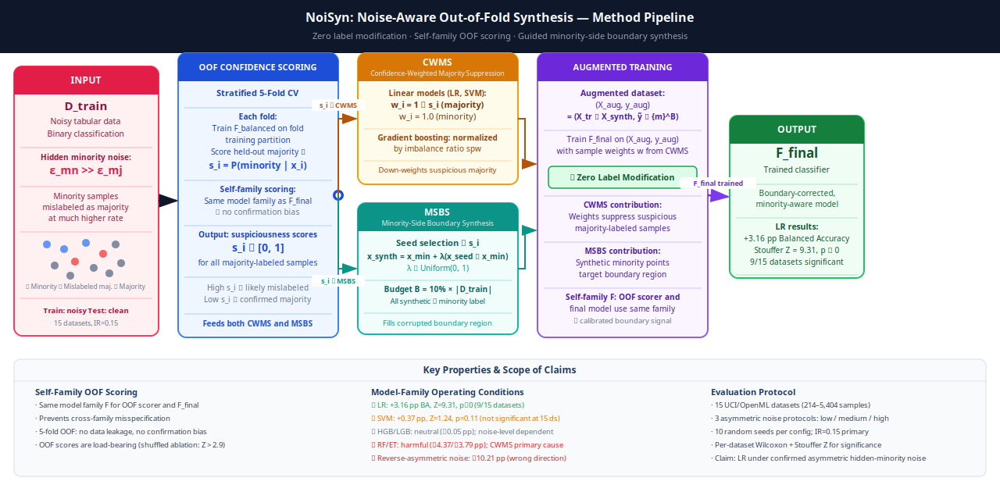

# NoiSyn: Noise-Aware Out-of-Fold Synthesis for Imbalanced Classification under Hidden Minority-Class Label Corruption

> **Confidence-weighted majority suppression + minority-side boundary synthesis — zero label modification.**

---

## Abstract

- Hidden minority-class label noise (minority samples mislabeled as majority, ε_mn >> ε_mj) systematically erodes the decision boundary in imbalanced classification.
- Standard oversampling methods (SMOTE, IW-SMOTE) amplify this corruption by synthesizing from a contaminated minority pool.
- **NoiSyn** combines out-of-fold (OOF) confidence scoring with two complementary mechanisms — Confidence-Weighted Majority Suppression (CWMS) and Minority-Side Boundary Synthesis (MSBS) — without modifying any labels.
- The OOF scorer uses the **same model family** as the final predictor, trained via stratified 5-fold CV, preventing confirmation bias.
- Across 15 UCI/OpenML tabular datasets, 3 model families (LR, SVM, HGB), 3 asymmetric noise protocols, and 10 seeds:
  - **Logistic Regression**: +3.16 pp balanced accuracy vs class-proportional reweighting (Stouffer Z = 9.31, p ≈ 0, 9/15 datasets significant)
  - **Recall recovery**: +22 pp minority recall for LR under medium noise (0.50 → 0.72)
  - **LR vs IW-SMOTE**: +0.71 pp numerically, not statistically significant across all protocols; +3.81 pp under medium noise specifically
  - **SVM**: not significant at 15-dataset scale (+0.37 pp, Z = 1.24, p = 0.11); stronger at IR=0.30 (+4.05 pp)
  - **HGB/LGB**: neutral (−0.05 pp); **RF/ET**: harmful (−4.37/−3.79 pp, CWMS identified as primary harm source)
- A shuffled-score ablation confirms OOF score ordering is load-bearing for all CWMS-compatible families (Z > 2.9).

---

## 1. Introduction

### Problem

Class imbalance and label noise frequently co-occur in real-world tabular datasets — medical screening, fraud detection, rare-fault classification. The standard response (oversampling the minority class) assumes the class boundary is cleanly observed. When label noise breaks this assumption, oversampling amplifies corruption rather than correcting it.

**Hidden minority-class noise** is a particularly damaging pattern: minority samples are mislabeled as majority at substantially higher rates than the reverse (ε_mn >> ε_mj). The effect is a systematic erosion of the minority class from training, shifting the learned boundary deeper into minority territory and collapsing minority recall.

### Motivation

Existing noise-robust oversampling methods (IW-SMOTE, SW Framework, CRN-SMOTE) estimate per-sample trustworthiness using a separate noise-detection model, introducing cross-family dependency and confirmation bias risk. Most evaluations use symmetric noise or natural noise — structurally incompatible with the asymmetric hidden-minority setting.

### Contributions

1. **NoiSyn pipeline**: combines confidence-weighted training (suppression) and guided minority-side synthesis without any label modification.
2. **Self-family OOF scoring**: the confidence scorer is a balanced instance of the same model family as the final predictor, calibrated to the same inductive bias, evaluated out-of-fold to prevent data leakage.
3. **Model-family characterization**: first systematic account of which classifier families benefit from confidence-weighted noise correction and why — significant/consistent for LR; neutral-to-negative for gradient boosting; actively harmful for bootstrap ensembles (RF/ET).
4. **Controlled benchmark**: first direct comparison of hidden-minority asymmetric noise methods on a standardized 15-dataset benchmark, with operating-condition characterization, component ablation, and imbalance-ratio sensitivity.

---

## 2. Method



### 2.1 Problem Setting

Training set D_train = {(x_i, ỹ_i)}: binary classification with minority label m and majority label M. Labels are corrupted — minority samples are flipped to majority with probability ε_mn, majority to minority with ε_mj, where ε_mn >> ε_mj. Test set is noise-free. Synthesis budget B = floor(0.10 × |D_train|).

### 2.2 OOF Confidence Scoring

Stratified 5-fold cross-validation. In each fold, a **balanced** instance of the final model family F is trained on the fold's training partition and scores held-out majority samples:

```
s_i = P_F^OOF(ỹ = m | x_i)   for majority-labeled samples
s_i = NaN                      for minority-labeled samples
```

High s_i = OOF model assigns high minority probability to a majority-labeled point → likely mislabeled. Using the same model family ensures the suspiciousness signal is calibrated to the inductive bias used at test time. OOF evaluation prevents confirmation bias.

### 2.3 CWMS — Confidence-Weighted Majority Suppression

```
Linear models (LR, SVM, RF, ET):
    w_i = 1 − s_i    for majority-labeled samples
    w_i = 1.0         for minority-labeled samples

Gradient boosting (HGB, LightGBM, CatBoost):
    w_i = (1 − s_i) × spw    for majority-labeled samples   [spw = |majority|/|minority|]
    w_i = spw                  for minority-labeled samples
```

### 2.4 MSBS — Minority-Side Boundary Synthesis

Seeds are drawn from the majority pool with probability ∝ s_i. Each seed x_seed is paired with a randomly chosen true minority sample x_min:

```
x_synth = x_min + λ × (x_seed − x_min),   λ ~ Uniform(0, 1)
```

All B synthetic points receive the minority label. No labels are modified at any step.

### 2.5 Full Pipeline

```
Input: D_train = (X_tr, ỹ), budget B, model family F

1. OOF Scoring
   For each fold in StratifiedKFold(5):
       Train F_balanced on fold training partition
       Score held-out majority samples → s_i = P(minority | x_i)

2. CWMS — compute sample weights w from s

3. MSBS — synthesise B minority points near the corrupted boundary
   using s as seed selection probabilities
   → (X_aug, y_aug) = (X_tr ∪ X_synth, ỹ ∪ {m}^B)

4. Train F_final on (X_aug, y_aug) with sample weights w

Output: trained F_final
```

**Zero label corrections are made at any step.**

---

## 3. Experiment Setup

| Component | Detail |
|-----------|--------|
| **Datasets** | 15 binary classification datasets from UCI and OpenML: Pima Diabetes (768), German Credit (1,000), Yeast (1,484), Ecoli (336), Phoneme (5,404), Breast Cancer Wisconsin (569), ILPD (583), Blood Transfusion (748), Haberman (306), Ionosphere (351), Vehicle (846), Glass Float (214), Abalone (4,177), Spambase (4,601), KC1 (2,109). All subsampled to target minority ratio 15%. |
| **Noise injection** | Asymmetric hidden-minority noise (ε_mn >> ε_mj) into training set only; test set retains clean labels. Three severity levels: low, medium, high. |
| **Models** | Logistic Regression, SVM (RBF), Histogram-based Gradient Boosting (scikit-learn defaults, no tuning). |
| **Baselines** | No Cleaning, SMOTE (Chawla et al., 2002), Class-Proportional reweighting (He & Garcia, 2009), IW-SMOTE (Zhang et al., 2022), SW-approx (Xu et al., 2022 — approximated via k-NN label inconsistency, no public code). |
| **Metrics** | Balanced Accuracy, Macro F1, Minority Precision, Minority Recall. All on clean held-out test set. |
| **Repetitions** | 10 seeds × 3 noise levels × 15 datasets = 450 pairs per model. Statistical significance: per-dataset one-sided Wilcoxon signed-rank test combined with Stouffer's Z across datasets. |
| **Hardware** | 13th Gen Intel Core i7-13700H (20 threads), 14 GB RAM, NVIDIA RTX 4060 Laptop (8 GB VRAM). |

---

## 4. Results

### Table 1 — Internal Benchmark (15 datasets × 10 seeds × 3 noise levels = 450 pairs per model)

| Model | Method | Balanced Acc. | F1 | Precision | Recall |
|-------|--------|:---:|:---:|:---:|:---:|
| Logistic Regression | No Cleaning | 0.5996 | 0.5727 | 0.6823 | 0.2103 |
| Logistic Regression | SMOTE | 0.6438 | 0.6347 | 0.7047 | 0.3214 |
| Logistic Regression | Class Prop. | 0.7025 | 0.7031 | 0.6542 | 0.4897 |
| Logistic Regression | **NoiSyn** | **0.7341** | **0.7045** | **0.5452** | **0.7160** |
| Support Vector Machine | No Cleaning | 0.5854 | 0.5442 | 0.5551 | 0.1746 |
| Support Vector Machine | SMOTE | 0.6376 | 0.6212 | 0.6938 | 0.2937 |
| Support Vector Machine | Class Prop. | 0.6729 | 0.6608 | 0.6641 | 0.3742 |
| Support Vector Machine | **NoiSyn** | **0.6766** | **0.6701** | **0.6913** | **0.3989** |
| Hist. Gradient Boosting | No Cleaning | 0.6514 | 0.6546 | 0.6442 | 0.3675 |
| Hist. Gradient Boosting | SMOTE | 0.6636 | 0.6678 | 0.6171 | 0.4165 |
| Hist. Gradient Boosting | Class Prop. | 0.6983 | 0.6992 | 0.6115 | 0.5091 |
| Hist. Gradient Boosting | **NoiSyn** | **0.6977** | **0.6683** | **0.5121** | **0.6749** |

*Precision and Recall refer to the minority class. NoiSyn intentionally trades minority precision for recall by targeting corrupted boundary samples.*

### LR by Noise Protocol (Stouffer per-dataset Wilcoxon, 15 datasets)

| Protocol | Class Prop. BA | NoiSyn BA | Δ (pp) | Stouffer Z | p | Sig. datasets |
|----------|:-:|:-:|:-:|:-:|:-:|:-:|
| hidden_minority_low | 0.7247 | 0.7594 | +3.47 | 7.22 | 2.7×10⁻¹³ | 10/15 |
| hidden_minority_medium | 0.7017 | 0.7398 | +3.81 | 6.28 | 1.7×10⁻¹⁰ | 10/15 |
| hidden_minority_high | 0.6811 | 0.7031 | +2.21 | 2.90 | 1.8×10⁻³ | 7/15 |
| **Combined** | 0.7025 | 0.7341 | **+3.16** | **9.31** | **≈0** | **9/15** |

### Table 2 — Competitor Comparison, Logistic Regression (450 pairs)

| Method | Balanced Acc. | F1 | Precision | Recall |
|--------|:---:|:---:|:---:|:---:|
| No Cleaning | 0.5996 | 0.5727 | 0.6823 | 0.2103 |
| SMOTE | 0.6438 | 0.6347 | 0.7047 | 0.3214 |
| SW-approx† | 0.6582 | 0.6539 | 0.6940 | 0.3565 |
| Class Prop. | 0.7025 | 0.7031 | 0.6542 | 0.4897 |
| IW-SMOTE | 0.7270 | 0.7112 | 0.5783 | 0.6443 |
| **NoiSyn** | **0.7341** | **0.7045** | **0.5452** | **0.7160** |

†SW Framework: no public code; approximated via k-NN label inconsistency scoring.

### NoiSyn vs each competitor — LR, all protocols (Stouffer Z)

| Competitor | Δ BA (pp) | Stouffer Z | p | Sig. datasets |
|------------|:-:|:-:|:-:|:-:|
| No Cleaning | +13.45 | 20.20 | ≈0 | 15/15 |
| Class Proportional | +3.16 | 9.31 | ≈0 | 9/15 |
| SMOTE | +9.03 | 18.54 | ≈0 | 14/15 |
| IW-SMOTE | +0.71 | 1.17 | 0.12 | 3/15 |
| SW-approx | +7.59 | 16.91 | ≈0 | 13/15 |

### Key Ablation: Shuffled-Score Ablation (OOF ordering load-bearing?)

| Model | NoiSyn BA | Shuffled BA | ΔBA (pp) | Stouffer Z | p |
|-------|:-:|:-:|:-:|:-:|:-:|
| Logistic Regression | 0.7341 | 0.7168 | +1.73 | 7.76 | 4.2×10⁻¹⁵ |
| SVM | 0.6766 | 0.6683 | +0.83 | 8.99 | ≈0 |
| HGB | 0.6977 | 0.6834 | +1.43 | 8.78 | ≈0 |
| Random Forest | 0.6708 | 0.6717 | −0.09 | −0.11 | 0.54 |

OOF score ordering is load-bearing for all CWMS-compatible families (Z > 2.9). RF shows no ordering signal (Z = −0.11), consistent with bootstrap averaging absorbing per-sample weights.

---

## 5. Conclusion & Future Work

### Conclusion

NoiSyn achieves statistically significant and consistent gains for logistic regression under confirmed asymmetric hidden-minority label noise (+3.16 pp balanced accuracy, Stouffer Z = 9.31, p ≈ 0, 9/15 datasets; +22 pp minority recall under medium noise). The method operates without any label modification, reusing OOF confidence scores already required for boundary detection at no extra training cost.

Component ablation on RF/ET identifies CWMS as the primary harm source for bootstrap ensembles (RF: −7.95 pp from CWMS alone), with MSBS causing secondary but smaller harm. The failure mode under reverse-asymmetric noise is severe (−10.21 pp for LR) — users must verify noise direction before applying NoiSyn. Under symmetric noise, the method degrades only slightly (−1.21 pp), as OOF scores are noisy but centred.

**Recommendation**: Apply NoiSyn specifically to logistic regression (and linear SVMs) under confirmed asymmetric hidden-minority label noise, where consistent and statistically significant gains are reproducible across diverse datasets and noise levels. Do not apply to bootstrap ensemble models or under reverse-asymmetric noise.

### Future Work

- **Multi-class extension**: NoiSyn is designed for binary classification; extending CWMS to softmax-output multi-class models requires per-class OOF confidence reformulation.
- **High-dimensional data**: Evaluation is restricted to tabular datasets (up to 5,404 samples). Behavior on high-dimensional or image-derived features is unexplored.
- **Extreme imbalance ratios**: Primary evaluation at IR=0.15; sensitivity at IR=0.30. Regime IR < 0.05 is unexplored.
- **Natural label noise**: All experiments inject synthetic noise; evaluation on datasets with known natural annotation uncertainty would strengthen real-world claims.
- **Adaptive budget**: Fixed B = 10% of training data is not tuned per dataset; an adaptive budget based on estimated noise level could improve performance at high noise.
- **SVM-NoiSyn characterization**: SVM benefit depends on imbalance ratio (not significant at IR=0.15 but +4.05 pp at IR=0.30). A theoretical analysis of why CWMS interacts with SVM margin differently at different IRs is open.

---

## Reproducibility

### Environment

```bash
conda activate dsp
# Python: /home/than-minh/miniconda3/envs/dsp/bin/python
# Key packages: sklearn 1.6.1, xgboost 3.1.2, lightgbm 4.6.0, catboost 1.2.8, pandas 2.3.3
```

### Quick Reproduction — Full 15-Dataset Benchmark (~4–6 h)

```bash
conda activate dsp

# Step 1: Download all 15 datasets
python scripts/download_datasets.py

# Step 2: Run full benchmark (24,750 rows: 7 CWMS models × 7 methods + 2 baseline models × 3 methods)
python scripts/run_full_benchmark_solution.py

# Step 3: Analyze Table 1 (internal benchmark, per-dataset Wilcoxon + Stouffer Z)
python scripts/analyze_full_benchmark.py
```

### External Comparison (Table 2)

```bash
python scripts/run_competitor_headtohead.py
python scripts/analyze_competitor_headtohead.py
```

### Outputs

| File | Rows | Description |
|------|------|-------------|
| `outputs/full-benchmark-solution-v2.csv` | 24,750 | Full 15-dataset benchmark |
| `outputs/competitor-headtohead-expanded.csv` | ~8,100 | LR+SVM+HGB × 15 datasets external comparison |
| `outputs/failure-mode-sweep.csv` | — | Symmetric/reverse-asymmetric noise protocols |
| `outputs/rfet-ablation-sweep.csv` | — | RF/ET component ablation |
| `outputs/iw-lamda-sweep.csv` | — | IW-SMOTE λ sensitivity (10, 20, 30, 50, 100) |

---

## Documentation

| File | Content |
|------|---------|
| `docs/paper-draft.md` | Full 8-section paper draft with all tables |
| `docs/results-reference.md` | All key numbers consolidated |
| `docs/reproducibility-guide.md` | Step-by-step reproduction with expected runtimes |
| `docs/codebase-summary.md` | Codebase overview and key file index |

---

## References

1. Chawla et al. (2002). SMOTE: Synthetic minority over-sampling technique. *JAIR*, 16, 321–357.
2. Frénay & Verleysen (2014). Classification in the presence of label noise: A survey. *IEEE TNNLS*, 25(5), 845–869.
3. He & Garcia (2009). Learning from imbalanced data. *IEEE TKDE*, 21(9), 1263–1284.
4. Northcutt et al. (2021). Confident learning: Estimating uncertainty in dataset labels. *JAIR*, 70, 1373–1411.
5. Xu et al. (2022). SW Framework: A noise-robust oversampling method. *Knowledge-Based Systems*.
6. Zhang et al. (2022). IW-SMOTE: An instance-weighted SMOTE. *Pattern Recognition*, 124, 108429.
7. Pedregosa et al. (2011). Scikit-learn: Machine learning in Python. *JMLR*, 12, 2825–2830.

---

## License

MIT License — see [LICENSE](LICENSE) for details.

## Citation

If you use this work, please cite:

```bibtex
@misc{noisyn2025,
  title   = {NoiSyn: Noise-Aware Out-of-Fold Synthesis for Hidden Minority-Class Label Corruption},
  author  = {Than Minh},
  year    = {2025},
  note    = {Preprint}
}
```
